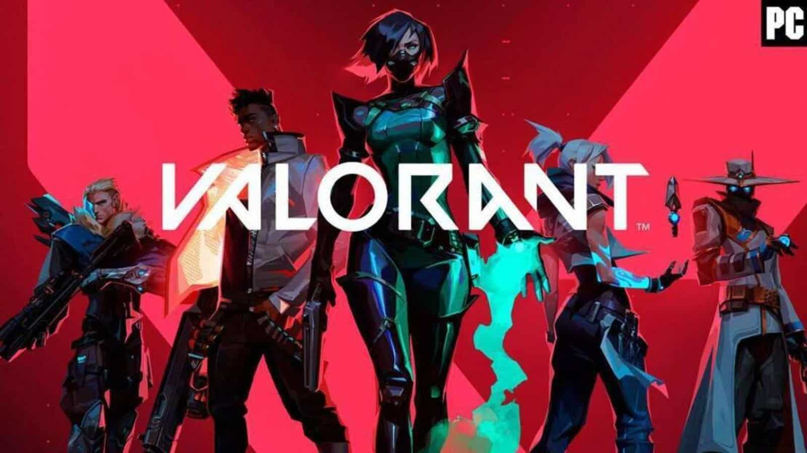

# What PC VIDEO GAME might suit you? 
Based on you and your interests, what pc video game(s) should you play?!

## Are you Interested in Shooting Games? 

### Not so much for warfare, but want to enjoy a first person hero shooter?
Try VALORANT! 
- Free-to-play
- A fast paced multiplayer first person hero shooter!
-  5v5 tactical bomb defusal 
- 8 Different Maps to play!
- 18 Unique agents for you to play each with their own unique abilities!

### Into team-based shooter games? 
Try CSGO! 
- A first person shooter
- Team-based objective based action game!
-  Rotation of 7 different maps!

### Or maybe hop into a futuristic setting where you can grind for better loot?
Try Destiny 2! 
- Free-to-play online-only multiplayer first-person shooter 
- In this action MMO, explore the mysteries of the solar system!
- Fight monsters, aliens and bosses! 
- Raid dungeons alone or with friends to get better loot! 

### Want to try a first person shooter that simulates warfare of World War II? 
 Try Call Of Duty! 
- A fast paced first shooter 
- You can choose your loadout of weapons to take onto the battle field! 
- So… What are you waiting for? 

### Want to battle it out against other players to be the champion? 
Try Apex Legends! 
- A free-to-play multiplayer battle royale-hero shooter game
- 22 Different characters with different abilities!
- Fast paced movement and tracking based game! 
- Loot the map, get weapons and armor and hop right into the action! 

